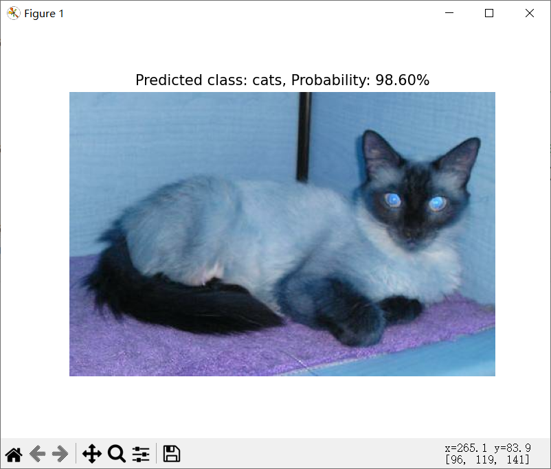
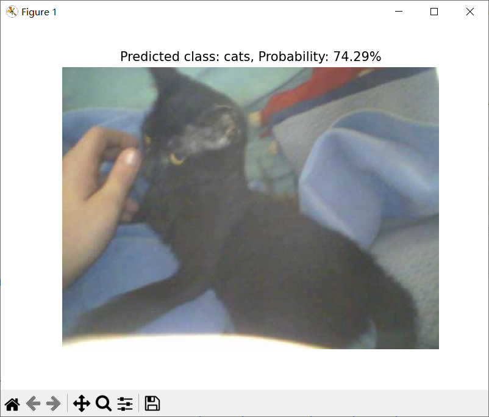
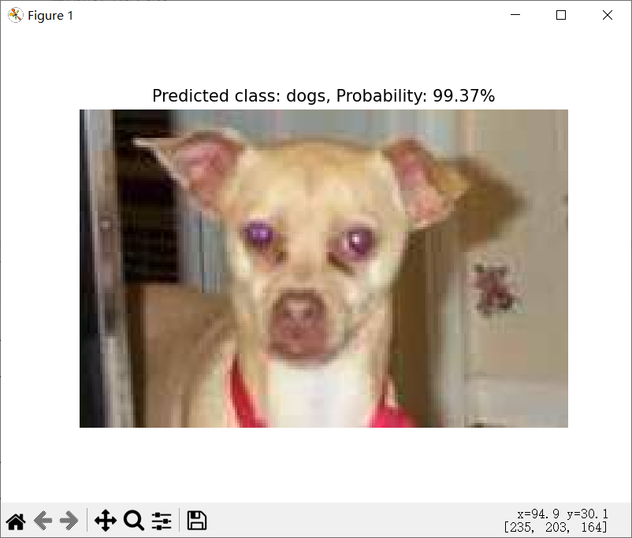
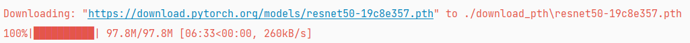
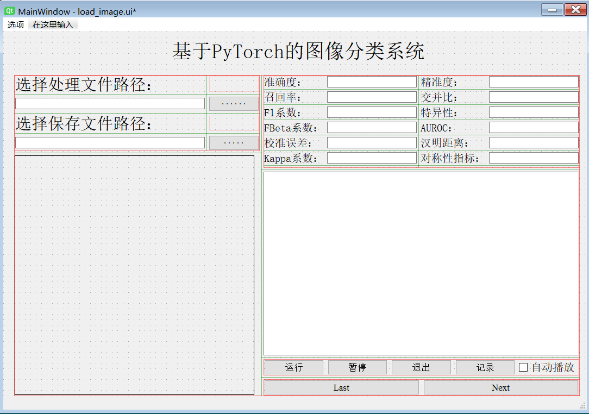

简体中文|[English](./READMEen.md)
# pytorch-classification-Auorui

## 简介
**一个基于pytorch的分类训练模版**  
此项目提供了一个清晰且高效的基于PyTorch的图像分类训练模板，旨在简化二分类和多分类任务的实现过程。
无论是初学者还是有一定经验的开发者，都可以通过这个模板快速上手并构建自己的图像分类模型。
 - 二分类和多分类：每个样本只能属于一个类别。二分类是特殊的多分类任务，类别数为2。多分类通过softmax来选择一个最可能的类别。

 - 多标签：每个样本可以同时属于多个类别，每个标签的预测是独立的，通常需要sigmoid输出每个标签的概率值。这带来了标签间的依赖问题，需要考虑标签的相关性。

遥想当初最开始学习的时候走了很多的弯路, 做了些许无用功, 很多人将一些深度学习项目做的很嵌套, 无法直接理解它这里写的意图是什么。这既是一个记录也是想要帮助大家
避免走弯路和做无用功，因此我整理和优化代码结构，我很希望能够使深度学习项目更加易于理解和维护。

本项目仅支持二分类和多分类任务，在多标签任务中，模型需要为每个标签分别进行预测，并在训练过程中计算更多的梯度， 
这可能会增加计算复杂度和训练时间。更重要的是我目前遇到的都是二分类和多分类，关于多标签的任务没有遇到过。

**作者：[Auorui(夏天是冰红茶)](https://github.com/Auorui)**

**联系方式：zjricetea@gmail.com('@'前为vx号，欢迎交流与学习)**

**CSDN博文教程：**

**B站教程：**

## 训练脚本
**./train.py**
### 安装所有依赖库
环境安装教程：[深度学习环境搭建入门环境搭建](https://blog.csdn.net/m0_62919535/article/details/134278573)
```
pip install torch   # 在官网下载gpu版本
pip install torchvision   # 在官网下载gpu版本
pip install opencv-python -i https://pypi.tuna.tsinghua.edu.cn/simple
pip install tqdm -i https://pypi.tuna.tsinghua.edu.cn/simple
pip install torchmetrics -i https://pypi.tuna.tsinghua.edu.cn/simple
pip install torchsummary -i https://pypi.tuna.tsinghua.edu.cn/simple
pip install natsort -i https://pypi.tuna.tsinghua.edu.cn/simple
pip install torchinfo -i https://pypi.tuna.tsinghua.edu.cn/simple
pip install argparse -i https://pypi.tuna.tsinghua.edu.cn/simple
pip install matplotlib -i https://pypi.tuna.tsinghua.edu.cn/simple
```

### 进行训练
要进行训练, 你可以使用以下命令行命令：
```
python train.py --model mobilenet_v2 --epochs 150 --batch_size 4 --lr 1e-3 --dataset_path "path_to_your_dataset"
```
如果不喜欢使用命令行, 请直接修改对应的 argparse 模块。 
## 推理脚本
**./infer.py**

### 进行推理
要进行推理, 你可以使用以下命令行命令：
```
python classification_infer.py --model mobilenet_v2 --weights ./logs/best_model.pth --categories ["daisy", "dandelion", "roses", "sunflowers", "tulips"] --image_path ./data/flower_data/test --save_dir ./results
```
可支持单图预测与文件夹预测, 修改image_path即可。

#### 单图预测
如果你的 image_path 是一个单独的图像文件路径, 脚本会读取这张图片并进行推理。例如：
在这种模式下，脚本会：

<div align="center">
    
</div>

1. 读取指定的单张图片。
2. 使用指定的模型进行推理。
3. 输出预测结果，包括预测类别和预测概率。
4. 显示原始图像和预测结果，使用 matplotlib 显示图像。

#### 文件夹预测
如果你的 image_path 是一个包含多张图片的文件夹路径，脚本会遍历该文件夹下的所有子文件夹和图片进行推理。例如：
在这种模式下，脚本会：
<p align="center">
  
  
  
  
  
</p>

1. 遍历指定文件夹路径下的所有子文件夹，确保每个子文件夹中包含的是图片。
2. 随机选择 5 张图片进行显示和推理。
3. 将其他图片的推理结果保存到一个 .txt 文件中，文件会包含每张图片的预测类别和概率。
```
Image: E:\PythonProject\Pytorch_Classification_Auorui\data\cat_dog\test\cats\cat.4087.jpg
Predicted class: cats
Probability: 74.29%
--------------------------------------------------
Image: E:\PythonProject\Pytorch_Classification_Auorui\data\cat_dog\test\dogs\dog.4413.jpg
Predicted class: dogs
Probability: 63.55%
--------------------------------------------------
Image: E:\PythonProject\Pytorch_Classification_Auorui\data\cat_dog\test\cats\cat.4146.jpg
Predicted class: cats
Probability: 99.88%
--------------------------------------------------
Image: E:\PythonProject\Pytorch_Classification_Auorui\data\cat_dog\test\dogs\dog.4771.jpg
Predicted class: dogs
Probability: 99.37%
--------------------------------------------------
Image: E:\PythonProject\Pytorch_Classification_Auorui\data\cat_dog\test\cats\cat.4799.jpg
Predicted class: cats
Probability: 99.13%
--------------------------------------------------
推理结果已保存到: ./result\inference_results2025_02_16_00_21_11.txt
```
## 可选择的训练参数
在基于PyTorch的分类训练模板中，提供了一系列可配置的训练参数，以便用户能够根据自己的需求和数据集特性来定制训练过程。
以下是这些训练参数的详细说明：

 * **model**  网络模型名称（str），需要添加其他的网络类型请修改 **./models/definite_net.py** 文件中的 MODEL_CLASSES。
 * **resume_training** 一个具体的预训练权重文件路径（str），也可用于断点训练
 * **log_dir** 指定日志文件存放的路径（str），不建议修改。
 * **num_classes** 分类任务中的类别数（int）。
 * **dataset_path** 一个具体的数据集路径（例如：r'D:\PythonProject\pytorch_classification_Auorui\data\flower_data'）
 * **epochs** 指定训练的总轮次（epochs）。
 * **input_shape** 指定输入图像的形状（高度和宽度）。
 * **batch_size** 指定每个批次（batch）中的图像数量。如果内存不足，可以尝试减小此值。还有问题请[参考](https://blog.csdn.net/m0_62919535/article/details/132725967) 。
 * **lr** 指定初始学习率，是一个经验值。
 * **momentum** 指定优化器中的动量参数，用于控制梯度更新的方向和速度。
 * **weight_decay** 指定优化器中的权重衰减参数，用于抑制权重的过度增长，防止过拟合。
 * **optimizer_type** 指定要使用的优化器类型，可选的有'adam'、'adamw'和'sgd'。
 * **lr_schedule_type** 指定学习率下降算法的类型，可选的有'cos'（余弦退火）、'step'（多步骤下降）、'multistep'和'warmup'。我这里推荐使用'cos'。
 * **freq** 指定在训练过程中保存检查点（.pth文件）的频率。不宜设置得太频繁，以避免占用过多磁盘空间。如果你想加入指标，也可用此参数控制，并不是每一轮进行指标计算就是好的。
 
## 数据集
### 示例数据集
二分类 ：[猫狗分类](https://www.kaggle.com/datasets/tongpython/cat-and-dog)

多分类 ：[花卉分类](https://github.com/WZMIAOMIAO/deep-learning-for-image-processing/tree/master/data_set)

二者均为演示示例, 你可以根据自己的需求来完成你的项目。下载好后放入 **./data** 文件加下

### 标准数据集格式
    data
        base
            -train
                -crack
                -rust
                -spalling
                -stoma
            -val
            -test
标准训练集如上所示, 训练集和验证集必须存在, 但测试集不一定要有。
### 划分脚本

这里以花卉数据集为例, 只需要修改目标文件夹以及保存路径, 运行即可。
如果数据集不够, 可将测试集比例设置为 0 , 即不划分测试集, 仅划分训练集和测试集。

    flower_photos                    
        - daisy                                      flower_data
        - dandelion                                      - val
        - roses            --------------------->        - test
        - sunflowers                                     - train
        - tulips

## 经典的网络模型
### 网络定义
主干网络放在 **./models/model_data部分**, 均使用的是torchvision官方实现的网络。可以在 **./models/definite_net.py** 文件中将网络添加到 **MODEL_CLASSES** 字典当中
 - [vgg](https://blog.csdn.net/m0_62919535/article/details/132189691)
 - [resnet](https://blog.csdn.net/m0_62919535/article/details/132384303)
 - [alexnet](https://blog.csdn.net/m0_62919535/article/details/128531393)
 - [googlenet](https://blog.csdn.net/m0_62919535/article/details/135895256)
 - [densenet](https://blog.csdn.net/m0_62919535/article/details/132476899)
 - mnasnet
 - [mobilenet](https://blog.csdn.net/m0_62919535/article/details/136091766)
 - [squeezenet](https://blog.csdn.net/m0_62919535/article/details/135901021)
 - [shufflenet](https://blog.csdn.net/m0_62919535/article/details/136862818)
 - regnet
 - efficientnet
 - [Vision Transformer](https://blog.csdn.net/m0_62919535/article/details/144936876)
 - [Swin Transformer](https://blog.csdn.net/m0_62919535/article/details/144952747)

一些相对简单的分类, 例如猫狗, 即使是重头开始训练也能获得不错的结果。
### 预训练权重下载方式
进入 **./models/pretraining_weights.py** , 选择要下载的文件运行即可, 如下所示为resnet50下载。



下载好的文件默认放置在 **./models/download_pth** 文件夹下面。

## 可视化设计
设计文件在 **./ui_classification/load_image.py**。
这里我们采用PyQt5来设计界面, [PyQt5安装教程](https://blog.csdn.net/m0_62919535/article/details/129014615)

专为深度学习开发者设计的PyQt5快速上手教程[B站教程](https://www.bilibili.com/video/BV18JreYpEVv/), 
视频对应的[图文教程](https://blog.csdn.net/m0_62919535/article/details/144813338) 。

<div align="center">
    
</div>
本项目不提供原ui设计文件, 这部分应当自己设计。

### ui参数设置
参数设置均在./runui.py当中, 你需要修改的有ui设计的界面名称, 输入大小, 类别, 网络模型以及训练好的权重。 


### 界面运行


这里因为仅做演示, 故没有选择保存路径, 点击"记录"按钮这里可以将检测结果导出, 但只能将"plainTextEdit"控件里面
的内容进行保存。

**运行流程如下所示：**

选择图像文件夹 
- 点击选择图像文件夹按钮，选择一个包含花卉图像的文件夹。
- 点击选择保存路径按钮，选择一个文件夹用于保存分类结果。如果没有选择则会仅仅显示图像的结果。

运行分类
- 点击运行按钮，程序会显示第一张图像及其分类结果。
- 性能指标会实时更新并显示在界面上。

自动播放选择
- 如果勾选“自动播放”复选框，程序会自动切换图像。
- 点击“暂停”按钮可以暂停自动播放，点击“恢复”按钮可以继续播放。

保存结果
- 点击记录按钮，会将分类结果保存到txt文件中。

退出程序
- 点击退出按钮，程序会提示用户确认退出。

## 常见问题

一、不存在某个包
```
答：先查看是否为第三方库如果仍然无法找到, 检查是否正确设置了Python环境和库的路径, 确保你使用的Python解释器与当前环境匹配。
如果报错的包是自定义模块（如 utils, models 等）, 可能是路径引用错误, 可去了解一下绝对路径和相对路径的概念。 
```
二、Cuda报显卡不足

[解决方案](https://blog.csdn.net/m0_62919535/article/details/132725967)
```
答：CUDA显卡不足的错误通常是由于显存溢出或多进程使用显卡资源导致的。解决方案包括：

清理C盘和存储盘，确保足够的硬盘空间。
尝试减少batch size来减轻显卡负担。
使用torch.cuda.empty_cache()清理显存缓存。
如果有多张显卡，尝试指定使用的显卡：torch.cuda.set_device(device_id)
检查显卡驱动和CUDA版本是否匹配，并更新到兼容版本。
```
三、学习率是怎么设置的，有什么依据吗？

[仅作参考](https://blog.csdn.net/m0_62919535/article/details/134360838)
```
答：学习率设置通常依赖于模型的训练经验。一般来说，默认的学习率取值通常为1e-4或1e-5，但它也与具体任务、数据集以及模型架构有关。
```
四、模型训练不收敛，怎么办？
```
答：模型训练不收敛的原因可能有很多，以下是常见的排查方式：

数据问题：检查数据是否正确加载，数据预处理是否正常。确保标签正确、数据格式一致。
模型架构：检查模型架构是否合理，尤其是输出层的维度和激活函数的选择。你可以尝试使用更简单的模型或调整模型层数。
优化器：使用不同的优化器（如Adam, SGD, RMSprop等）以及合适的超参数（如学习率、momentum等）。
数据增强：对训练数据进行增强，减少过拟合的可能性。
早停机制：如果训练过程不收敛，可以根据验证集的损失进行提前停止。(不建议使用)
```
五、训练过程中出现“nan”或“inf”值
```
答：先检查数据是否有缺失值或异常值, 进行必要的清洗和预处理, 然后再看是否是损失函数的问题。还可以尝试降低学习率。
```

