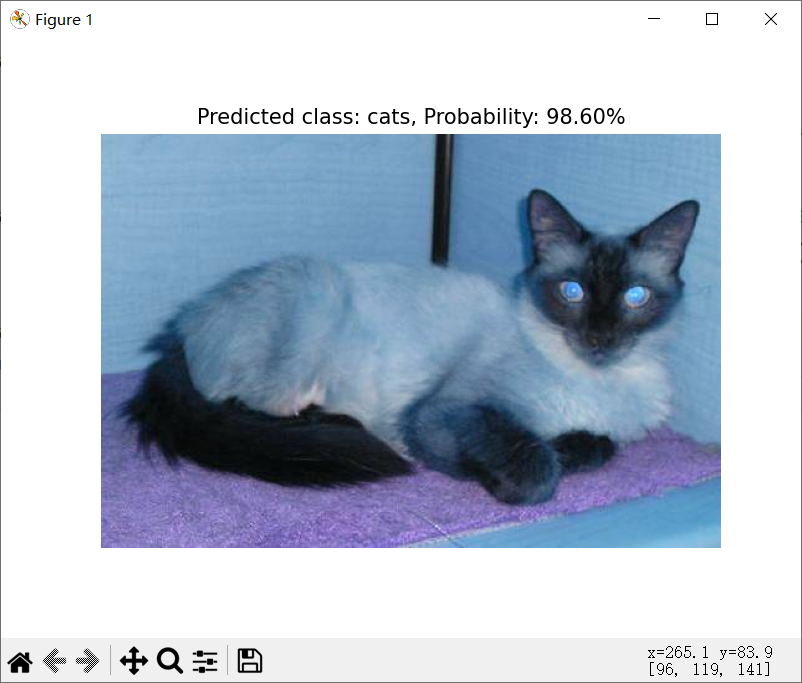
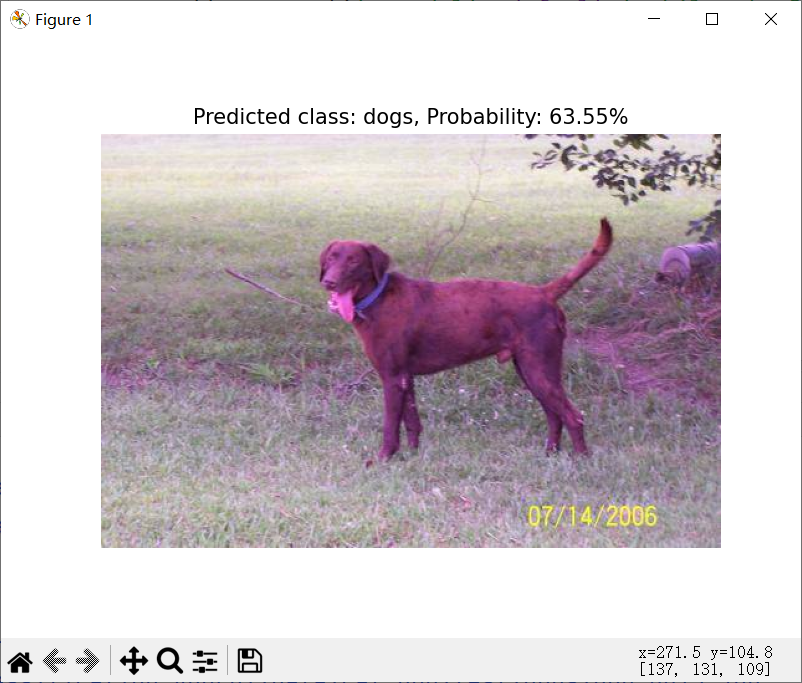
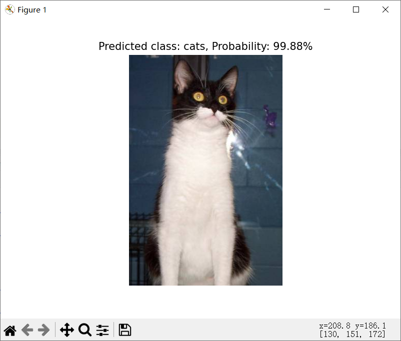
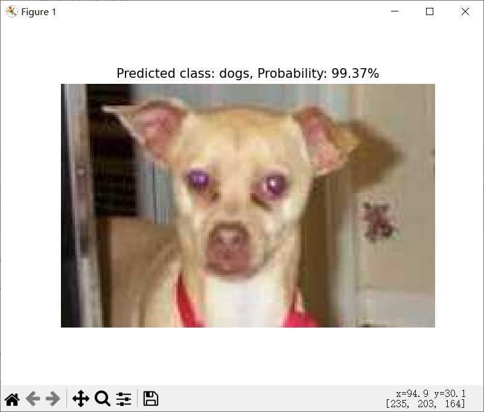
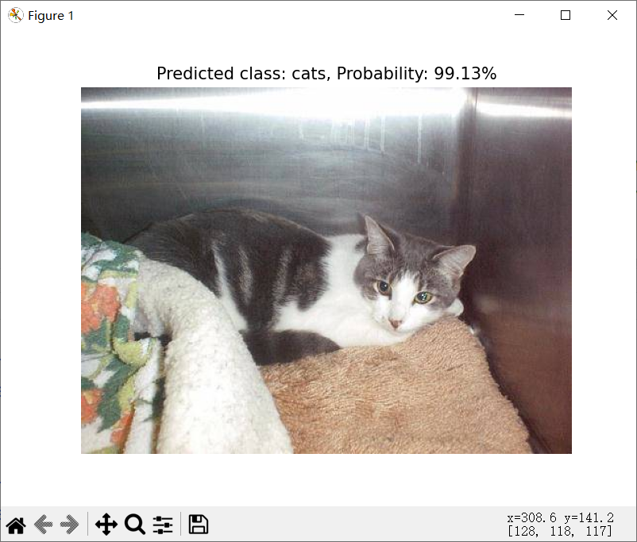
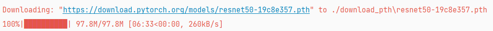
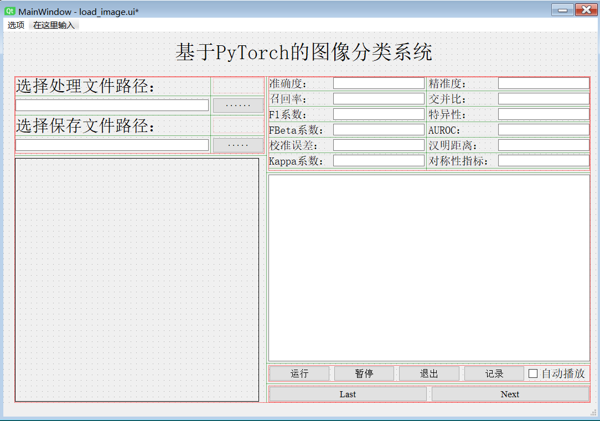
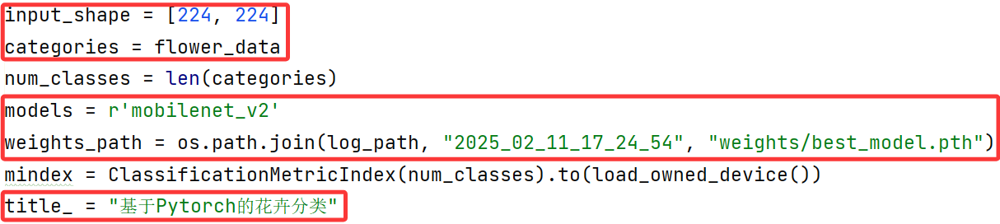

[简体中文](./README.md)|English

# pytorch-classification-Auorui

## Introduction
**A PyTorch-based classification training template**  
This project provides a clear and efficient PyTorch-based image classification training template, aiming to simplify the implementation of binary and multi-class classification tasks.  
Whether you're a beginner or an experienced developer, this template allows you to quickly get started and build your own image classification model.

- **Binary and Multi-class Classification:** Each sample can only belong to one category. Binary classification is a special case of multi-class classification with two categories. Multi-class classification uses softmax to select the most likely category.

- **Multi-label Classification:** Each sample can belong to multiple categories at the same time, and the prediction for each label is independent, usually requiring a sigmoid output to predict the probability for each label. This introduces a dependency problem between labels, and the correlation between labels needs to be considered.

I remember when I first started learning, I made many detours and wasted time on unnecessary tasks. Many people make their deep learning projects too complicated, making it hard to understand the original intent. This project is both a record of my journey and a way to help others avoid unnecessary work and detours. I've organized and optimized the code structure to make deep learning projects easier to understand and maintain.

This project supports only binary and multi-class classification tasks. In multi-label tasks, the model needs to predict each label independently, which may increase computational complexity and training time. However, I've mostly worked with binary and multi-class classification and have not encountered multi-label tasks yet.

**Author: [Auorui (Xia Tian Shi Bing Hong Cha)](https://github.com/Auorui)**

**Contact: zjricetea@gmail.com (use the 'vx' for WeChat contact, welcome to exchange and learn)**

**CSDN Blog Tutorial:[A deep learning project suitable for beginners - Pytorch based image classification system](https://blog.csdn.net/m0_62919535/article/details/145713389) (Provided detailed supplements to the project)**

**Bilibili Tutorial:[Pytorch based image classification system, the most suitable project for beginners](https://www.bilibili.com/video/BV1kSPTe4EQa/)**

## Training Script
**./train.py**

### Install all dependencies
Environment setup guide: [Deep learning environment setup guide](https://blog.csdn.net/m0_62919535/article/details/134278573)
```
pip install torch   # 在官网下载gpu版本
pip install torchvision   # 在官网下载gpu版本
pip install opencv-python -i https://pypi.tuna.tsinghua.edu.cn/simple
pip install tqdm -i https://pypi.tuna.tsinghua.edu.cn/simple
pip install torchmetrics -i https://pypi.tuna.tsinghua.edu.cn/simple
pip install torchsummary -i https://pypi.tuna.tsinghua.edu.cn/simple
pip install natsort -i https://pypi.tuna.tsinghua.edu.cn/simple
pip install torchinfo -i https://pypi.tuna.tsinghua.edu.cn/simple
pip install argparse -i https://pypi.tuna.tsinghua.edu.cn/simple
pip install matplotlib -i https://pypi.tuna.tsinghua.edu.cn/simple
```

### Train the model
To start training, you can use the following command line:
```
python train.py --model mobilenet_v2 --epochs 150 --batch_size 4 --lr 1e-3 --dataset_path "path_to_your_dataset"
```
If you prefer not to use the command line, you can modify the argparse module directly.

## Inference Script
**./infer.py**

### Perform inference
To run inference, you can use the following command line:
```
python classification_infer.py --model mobilenet_v2 --weights ./logs/best_model.pth --categories ["daisy", "dandelion", "roses", "sunflowers", "tulips"] --image_path ./data/flower_data/test --save_dir ./results
```

This supports both single-image and folder-based prediction, just modify the `image_path` accordingly.

#### Single Image Prediction
If your `image_path` is a single image file path, the script will read the image and perform inference. In this mode, the script will:

<div align="center">
    
</div>

1. Read the specified image.
2. Use the specified model for inference.
3. Output the predicted class and probability.
4. Display the original image and the prediction result using Matplotlib.

#### Folder-based Prediction
If your `image_path` is a folder containing multiple images, the script will iterate over all subfolders and images in the folder and perform inference. In this mode, the script will:

<p align="center">
  
  
  
  
  
</p>

1. Iterate through all subfolders within the specified folder, ensuring that each subfolder contains images.
2. Randomly select 5 images to display and perform inference.
3. Save the inference results of the remaining images in a `.txt` file, containing each image's predicted class and probability.

```
Image: E:\PythonProject\Pytorch_Classification_Auorui\data\cat_dog\test\cats\cat.4087.jpg
Predicted class: cats
Probability: 74.29%
--------------------------------------------------
Image: E:\PythonProject\Pytorch_Classification_Auorui\data\cat_dog\test\dogs\dog.4413.jpg
Predicted class: dogs
Probability: 63.55%
--------------------------------------------------
Image: E:\PythonProject\Pytorch_Classification_Auorui\data\cat_dog\test\cats\cat.4146.jpg
Predicted class: cats
Probability: 99.88%
--------------------------------------------------
Image: E:\PythonProject\Pytorch_Classification_Auorui\data\cat_dog\test\dogs\dog.4771.jpg
Predicted class: dogs
Probability: 99.37%
--------------------------------------------------
Image: E:\PythonProject\Pytorch_Classification_Auorui\data\cat_dog\test\cats\cat.4799.jpg
Predicted class: cats
Probability: 99.13%
--------------------------------------------------
推理结果已保存到: ./result\inference_results2025_02_16_00_21_11.txt
```

## Available Training Parameters
The PyTorch-based classification template provides a series of configurable training parameters to help users tailor the training process based on their needs and dataset characteristics. Below are detailed descriptions of these parameters:

* **model**  Network model name (str), add other network types by modifying **./models/definite_net.py** in the MODEL_CLASSES dictionary.
* **resume_training** A specific pre-trained weight file path (str), can also be used for checkpoint training.
* **log_dir** Path where log files are stored (str), don't modify it.
* **num_classes** The number of categories in the classification task (int).
* **dataset_path** The path to your dataset (e.g., `r'D:\PythonProject\pytorch_classification_Auorui\data\flower_data'`).
* **epochs** The number of training epochs.
* **input_shape** The input image shape (height and width).
* **batch_size** The number of images in each batch. If memory is insufficient, try reducing this value. For more info, [click here](https://blog.csdn.net/m0_62919535/article/details/132725967).
* **lr** The initial learning rate, which is an empirical value.
* **momentum** The momentum parameter in the optimizer to control gradient update direction and speed.
* **weight_decay** The weight decay parameter in the optimizer to prevent overfitting by suppressing excessive weight growth.
* **optimizer_type** The optimizer type to use, can be 'adam', 'adamw', or 'sgd'.
* **lr_schedule_type** The type of learning rate decay algorithm, options are 'cos' (cosine annealing), 'step' (multi-step decay), 'multistep', and 'warmup'. I recommend using 'cos'.
* **freq** The frequency of saving checkpoints (.pth files) during training. Don't set this too frequently to avoid excessive disk space usage. You can control metrics calculation with this parameter.

## Dataset
### Example Datasets
- **Binary Classification:** [Cat and Dog Classification](https://www.kaggle.com/datasets/tongpython/cat-and-dog)
- **Multi-class Classification:** [Flower Classification](https://github.com/WZMIAOMIAO/deep-learning-for-image-processing/tree/master/data_set)

These are demonstration datasets, and you can use them as needed for your project. After downloading, place them in the **./data** folder.

### Standard Dataset Structure
    data
        base
            -train
                -crack
                -rust
                -spalling
                -stoma
            -val
            -test
The standard training set requires both a training and validation set, though a test set is optional.

### Splitting Script
Here’s an example using the flower dataset. Simply modify the target folder and save path, and run it. If the dataset is insufficient, you can set the test set ratio to 0 and only split the training and validation sets.

    flower_photos                    
        - daisy                                      flower_data
        - dandelion                                      - val
        - roses            --------------------->        - test
        - sunflowers                                     - train
        - tulips

## Classic Network Models
### Network Definitions
The backbone networks are placed in **./models/model_data** and are based on official implementations from torchvision. You can add networks to the **MODEL_CLASSES** dictionary in **./models/definite_net.py**.
 - [vgg](https://blog.csdn.net/m0_62919535/article/details/132189691)
 - [resnet](https://blog.csdn.net/m0_62919535/article/details/132384303)
 - [alexnet](https://blog.csdn.net/m0_62919535/article/details/128531393)
 - [googlenet](https://blog.csdn.net/m0_62919535/article/details/135895256)
 - [densenet](https://blog.csdn.net/m0_62919535/article/details/132476899)
 - mnasnet
 - [mobilenet](https://blog.csdn.net/m0_62919535/article/details/136091766)
 - [squeezenet](https://blog.csdn.net/m0_62919535/article/details/135901021)
 - [shufflenet](https://blog.csdn.net/m0_62919535/article/details/136862818)
 - regnet
 - efficientnet
 - [Vision Transformer](https://blog.csdn.net/m0_62919535/article/details/144936876)
 - [Swin Transformer](https://blog.csdn.net/m0_62919535/article/details/144952747)

Some relatively simple classifications, such as cats and dogs, can achieve good results even if trained from scratch.

### 预训练权重下载方式
Pretrained Weights Download Method
Go to ./models/pretraining_weights.py, select the file you want to download and run it. The example below shows the download for ResNet50.



The downloaded files are placed in the **./models/download_pth** folder by default.

## Visualization Design
The design files are located in **./ui_classification/load_image.py**。
Here, we use PyQt5 to design the interface. [PyQt5 Installation Tutorial](https://blog.csdn.net/m0_62919535/article/details/129014615)

A quick-start PyQt5 tutorial designed specifically for deep learning developers: [Bilibili Tutorial](https://www.bilibili.com/video/BV18JreYpEVv/),
The corresponding [text tutorial](https://blog.csdn.net/m0_62919535/article/details/144813338) 。

<div align="center">
    
</div>
This project does not provide the original UI design file, this part should be designed by oneself.

### UI Parameter Settings
The parameter settings are all in ./runui.py, you need to modify the UI design interface name, input size, category, network model, and trained weights.



### Interface Operation


Here, since it is only a demonstration, no save path is selected. Clicking the "Record" button can export the detection results, but only the content in the "plainTextEdit" control can be saved.

**The operation process is as follows:**

Select Image Folder
 - Click the "Select Image Folder" button to choose a folder containing flower images.
 - Click the "Select Save Path" button to choose a folder for saving the classification results. If no path is selected, only the image results will be displayed.

Run Classification

 - Click the "Run" button, and the program will display the first image and its classification result.
 - Performance metrics will be updated in real-time and displayed on the interface.

Auto-play Option

 - If the "Auto-play" checkbox is checked, the program will automatically switch images.

 - Click the "Pause" button to pause auto-play, and click the "Resume" button to continue.

Save Results

 - Click the "Record" button to save the classification results to a txt file.

Exit Program

 - Click the "Exit" button, and the program will prompt the user to confirm exit.

## Frequently Asked Questions
一、A certain package does not exist
```
Answer: First check if it is a third-party library. If it still cannot be found, check if the Python environment and library paths are set correctly to ensure that the Python interpreter you are using matches the current environment.
If the package reporting the error is a custom module (such as utilities, models, etc.), it may be a path reference error. You can learn about the concepts of absolute and relative paths.
```
二、Cuda reports insufficient graphics card

[Solution](https://blog.csdn.net/m0_62919535/article/details/132725967)
```
答：The error of insufficient CUDA graphics card is usually caused by overflow of video memory or multiple processes using graphics card resources. The solution includes:

Clean up the C drive and storage drive to ensure sufficient hard disk space.
Try reducing the batch size to alleviate the burden on the graphics card.
Clean up the video memory cache using torch. CUDA. mpty_cache().
If there are multiple graphics cards, try specifying which one to use: torch.cuda.set_device(device_id)
Check if the graphics card driver matches the CUDA version and update to a compatible version.
```
三、How is the learning rate set and is there any basis for it?

[仅作参考](https://blog.csdn.net/m0_62919535/article/details/134360838)
```
Answer: The learning rate setting usually depends on the model's training experience. Generally speaking, the default learning rate value is usually 1e-4 or 1e-5, but it also depends on the specific task, dataset, and model architecture.
```
四、What should I do if the model training does not converge?
```
Answer: There may be many reasons why the model training does not converge, and the following are common troubleshooting methods:
Data issue: Check if the data is loaded correctly and if data preprocessing is normal. Ensure that the labels are correct and the data format is consistent.
Model architecture: Check whether the model architecture is reasonable, especially the dimensions of the output layer and the selection of activation functions. You can try using simpler models or adjusting the number of layers in the model.
Optimizer: Use different optimizers (such as Adam, SGD, RMSprop, etc.) and appropriate hyperparameters (such as learning rate, momentum, etc.).
Data augmentation: Enhance the training data to reduce the possibility of overfitting.
Early stopping mechanism: If the training process does not converge, it can be stopped early based on the loss of the validation set. (Not recommended for use)
```
五、During the training process, "nan" or "inf" values appear
```
Answer: First, check if there are missing or abnormal values in the data, perform necessary cleaning and preprocessing, and then see if it is a problem with the loss function. You can also try to reduce the learning rate.
```
